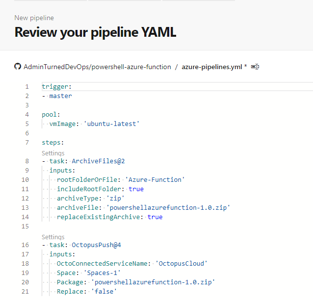

## Build Process
Depending on how you are building and packaging code, this may vary. To complete the CI process, I used Azure DevOps pipelines to build the PowerShell code and send the package to Octopus Deploy.

See the YAML pipeline code snippet and the screenshot below

```
trigger:
- master

pool:
  vmImage: 'ubuntu-latest'

steps:
- task: ArchiveFiles@2
  inputs:
    rootFolderOrFile: 'Azure-Function'
    includeRootFolder: true
    archiveType: 'zip'
    archiveFile: 'powershellazurefunction-1.0.zip'
    replaceExistingArchive: true

- task: OctopusPush@4
  inputs:
    OctoConnectedServiceName: 'OctopusCloud'
    Space: 'Spaces-1'
    Package: 'powershellazurefunction-1.0.zip'
    Replace: 'false'
```

