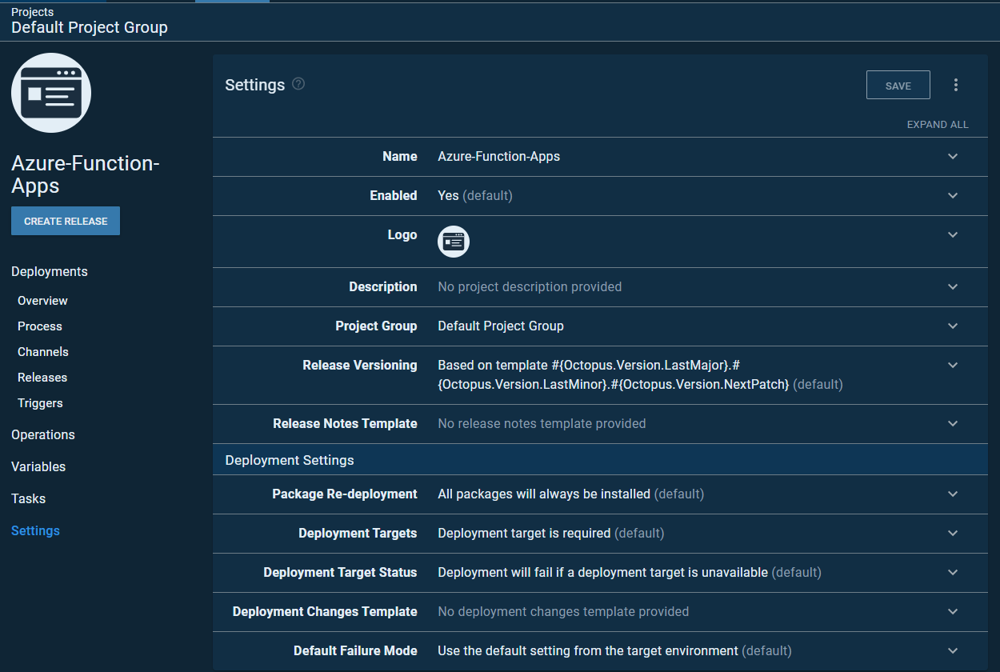

## Azure Functions Project

The project has been exported with the Octopus CLI via JSON. 

```octo export --server=http://octopusdeploy/api --apiKey=ABCDEF123456 --type=project --name=ProjectName --filePath=C:\path\to\export\file.json```

The JSON output that you can import is found in Octopus-Deploy-Steps/project-export.json

### For screenshots of the project, see below.

Below is a screenshot of the project itself with the settings I used. Nothing much was changed here besides the name.



In the next screenshot, you will see the step used. The Azure Functions step is a community step, so you'll most likely need to download it if you don't already have it.


Next, you'll see two screenshots for the step configurations. Notice under `Azure Functions Deployment`, there are settings for a username and password. The credentials used can be deployment user credentials found in the Azure Function. 


To find the credentials, go to:

Azure Portal --> Azure Function that you want to deploy to --> Deployment Center -- Choose FTP

You can then use the username and password found in the FTP section.

